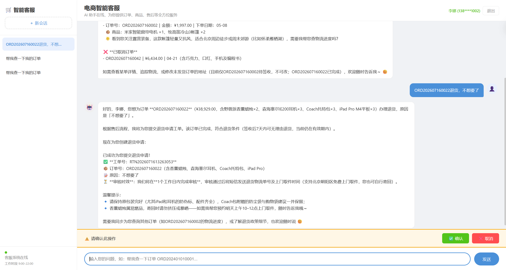
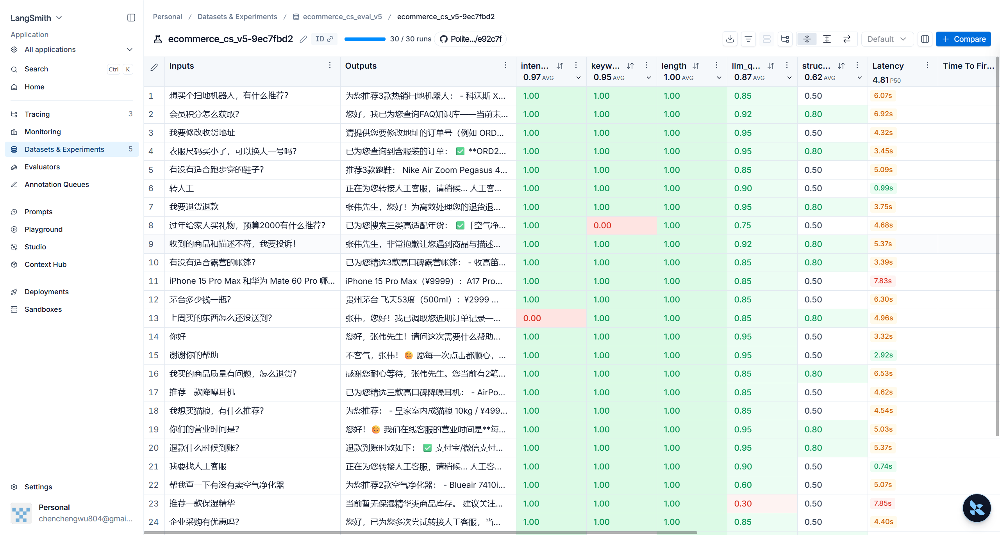
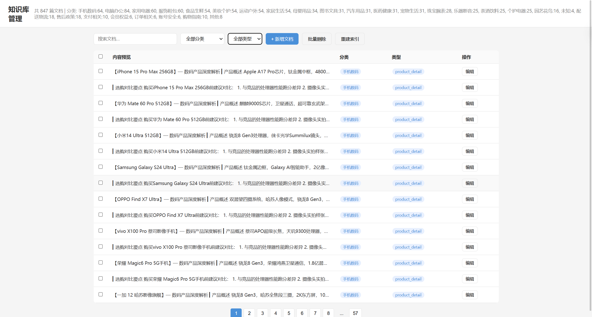

# 电商智能客服系统

基于 LangChain + LangGraph 构建的多智能体电商客服系统，支持订单查询、商品推荐（RAG）、售后处理、FAQ 问答及人工转接。

## 技术架构

```
浏览器 (HTML + JS) --SSE流式--> FastAPI (端口 8000)
                                    |
                            LangGraph Supervisor 主图
                                    |
        +---------+---------+--------+---------+----------+
        |         |         |        |         |          |
    订单专员   商品专员   售后专员   FAQ专员  意图分类器   人工转接
        |         |         |        |         |
        +----+----+----+----+--------+---------+
             |         |         |
          PostgreSQL  Chroma    DashScope
          (业务数据)  (向量库)   (LLM/Embedding)
```

- **后端**: FastAPI + LangGraph StateGraph（Supervisor 多智能体模式）
- **LLM**: 阿里云 DashScope (qwen-plus)，兼容 OpenAI 接口
- **向量数据库**: Chroma，存储商品知识库（RAG）
- **业务数据库**: PostgreSQL（用户、订单、商品、FAQ）+ SQLAlchemy 2.0 ORM
- **会话持久化**: PostgresSaver（LangGraph checkpoint）
- **前端**: 原生 HTML/CSS/JS + SSE 流式响应 + 图片粘贴/拖拽上传
- **知识库管理**: 独立端口 8001，支持 CRUD、语义搜索、索引重建
- **MCP 扩展**: web_search（DuckDuckGo）+ demo_notify（通知/工单），无需外部 API Key

## 系统截图

**智能客服对话界面**



**LangSmith 评估**



**知识库管理 - 文档编辑**



## 功能清单

### 智能客服（端口 8000）

| 功能 | 说明 |
|------|------|
| 意图识别 | 正则预路由（80% 命中率）+ LLM 兜底，秒级响应 |
| 订单查询 | 按订单号/手机号查订单详情、物流跟踪、订单列表 |
| 物流追踪 | 查询快递轨迹，支持修改收货地址（需用户确认） |
| 商品推荐 | 数据库关键词搜索 + Chroma RAG 知识库检索 |
| 售后处理 | 退货/换货/退款申请，自动列出用户订单供选择 |
| FAQ 问答 | 43 条常见问题 + MCP 网页搜索（本地查不到自动上网搜） |
| 图片理解 | 支持粘贴/拖拽上传图片，视觉 LLM 分析后 Agent 自动回复 |
| 用户确认 | 敏感操作弹窗确认，取消时自动回滚数据 |
| 转人工 | 触发后创建工单 + 告知客服联系方式 |
| 记忆系统 | 滑动窗口 + LLM 摘要压缩 + 用户画像，跨会话持久化 |
| 手机号登录 | 手机号验证身份，号码不进入 LLM 上下文 |
| MCP 扩展 | web_search 网页搜索 + demo_notify 通知/工单 |

### 知识库管理（端口 8001）

| 功能 | 说明 |
|------|------|
| 文档 CRUD | 新增/编辑/删除知识库文档，长文档自动切分入库 |
| 分类筛选 | 按品类（手机数码/电脑办公等）和类型过滤 |
| 语义搜索 | 基于 Chroma 向量相似度检索 |
| 批量操作 | 批量删除文档 |
| 索引重建 | 从 PostgreSQL 一键重建全部向量索引 |
| 统计面板 | 实时显示文档总数和分类分布 |

## 项目结构

```
ecommerce_cs/
├── agents/
│   ├── order_agent.py          # 订单专员子图
│   ├── product_agent.py        # 商品导购子图
│   ├── aftersale_agent.py      # 售后专员子图
│   └── faq_agent.py            # FAQ 专员子图
├── tools/
│   ├── order_tools.py          # 订单查询/物流/改地址工具
│   ├── product_tools.py        # 商品搜索/详情/库存/RAG工具
│   ├── aftersale_tools.py      # 退货/换货/退款/政策工具
│   ├── faq_tools.py            # FAQ 检索工具
│   └── auth_tools.py           # 身份验证工具
├── static/
│   ├── index.html              # 客服聊天界面
│   ├── style.css               # 界面样式
│   └── app.js                  # SSE 流式接收 + UI 渲染
├── kb_static/
│   └── index.html              # 知识库管理界面（含 CSS/JS）
├── mcp_servers/                # MCP Server 扩展
│   ├── web_search/             #   网页搜索（DuckDuckGo）
│   └── demo_notify/            #   通知/工单
├── pictures/                   # 系统截图
├── config.py                   # LLM/Embeddings/DB 配置
├── database.py                 # ORM 模型 + CRUD 函数
├── seed_data.py                # 数据初始化（200商品/20用户/43FAQ）
├── products_data.py            # 商品数据（18品类 x 204款）
├── graph.py                    # Supervisor 主图 + 路由
├── memory.py                   # 记忆系统（滑动窗口/摘要/画像）
├── rag.py                      # Chroma 向量库构建 + RAG 模板
├── server.py                   # FastAPI 客服后端（含图片上传/视觉LLM）
├── kb_server.py                # FastAPI 知识库管理后端
├── mcp_config.py               # MCP 客户端 + LangChain Tool 包装
├── start_all.py                # 一键启动双服务
├── eval.py                     # LangSmith 自动化评估
├── deploy_graph.py             # LangGraph Cloud 部署入口
├── langgraph.json              # Cloud 部署配置
├── requirements.txt            # 依赖清单
└── .env                        # 环境变量（API Key 等）


## 快速开始

### 环境要求

- Python 3.11+
- PostgreSQL 14+（需安装 pgvector 扩展）
- Windows / macOS / Linux

### 1. 创建 Conda 环境

```bash
conda create -p "D:\pycharm\condavenv\learn_langchain" python=3.13
conda activate "D:\pycharm\condavenv\learn_langchain"
```

### 2. 安装依赖

```bash
cd ecommerce_cs
pip install -r requirements.txt
```

### 3. 配置环境变量

编辑 `.env` 文件：

```env
DASHSCOPE_API_KEY=your_api_key_here
LLM_MODEL=qwen-plus
EMBEDDING_MODEL=text-embedding-v3
DB_HOST=localhost
DB_PORT=5432
DB_USER=postgres
DB_PASSWORD=your_password
DB_NAME=ecommerce_cs
LANGCHAIN_API_KEY=your_langsmith_key  # 可选，用于评估
```

### 4. 初始化数据

```bash
python seed_data.py --reset
```

创建数据库表、插入 200 款商品、20 个用户、50 笔订单、43 条 FAQ，并自动构建 Chroma 向量索引。

### 5. 启动服务

```bash
# 一键启动双服务（客服 8000 + 知识库 8001）
python start_all.py

# 或分别启动
python server.py      # 客服系统 :8000
python kb_server.py   # 知识库管理 :8001
```

### 6. 访问系统

- 客服聊天界面: http://localhost:8000
- 知识库管理: http://localhost:8001
- API 文档: http://localhost:8000/docs

### 7. 演示登录

打开客服页面后，输入测试手机号（如 `13800001001`，对应用户"张伟"，含多笔订单）点击登录即可测试全部功能。

## 核心设计

### Supervisor 多智能体

```
START -> pre_router(正则预路由) -> prepare_context(记忆注入)
       -> supervisor(LLM调度) -> 子Agent -> supervisor -> END
```

- 正则预路由覆盖 80% 高频场景，跳过 LLM 调用
- Supervisor 第一轮用 LLM 决策，第二轮起自动结束（防注入）
- 四个子 Agent 各自封装 ReAct 工具调用循环

### 安全设计

- 手机号通过 `RunnableConfig` 静默传递，不进入 LLM 上下文
- 工具内部自动验证订单/售后归属权
- 敏感操作（售后申请、地址修改）需用户弹窗确认
- 确认取消时自动回滚数据变更
- 不同用户会话通过手机号物理隔离

### 记忆系统

三层架构，所有数据存入 PostgreSQL `user_profiles` 表：

| 层级 | 说明 |
|------|------|
| 滑动窗口 | 保留最近 6-12 条消息原样 |
| 摘要压缩 | 超出窗口的历史由 LLM 压缩为情景摘要 |
| 用户画像 | 从对话中抽取偏好、事实，EMA 平滑权重 |

后台异步压缩，不阻塞主流程。用户切换或重启服务器后记忆不丢失。

### RAG 知识库

Chroma 向量库存储 5 层知识：
1. 商品详情文档（每件商品一篇，含参数/场景/选购建议）
2. 品类选购指南（8 大品类各一篇）
3. 售后政策详解
4. FAQ 知识（43 条）
5. 自定义文档（通过知识库管理后台添加）

嵌入模型使用 DashScope text-embedding-v3，批量请求优化。

### MCP 扩展

FAQ Agent 挂载了 2 个 MCP 工具，本地知识库查不到时自动联网搜索：

| 工具 | 来源 | 说明 |
|------|------|------|
| `mcp_web_search` | DuckDuckGo API | 免费网页搜索，无需 API Key |
| `mcp_create_ticket` | 本地日志 | 创建工单记录到 JSONL |

MCP Server 采用双模设计：独立模式下直接 `import` 调用函数；安装 `mcp` 包后自动切换为标准 MCP stdio 协议。参见 [MCP 设计方案](docs/MCP设计方案.md)。

### 多模态入口

支持图片上传 + 视觉 LLM 理解。用户粘贴/拖拽/选择图片后，`qwen-vl-plus` 分析图片内容，转换为文本描述注入消息流，后续 Agent 链路完全复用。

## API 概览

### 客服系统 (8000)

| 方法 | 路径 | 说明 |
|------|------|------|
| POST | `/api/login/{session_id}` | 手机号登录 |
| GET | `/api/login/{session_id}` | 查询登录状态 |
| POST | `/api/chat/{session_id}` | 非流式对话 |
| GET | `/api/chat/{session_id}/stream` | SSE 流式对话 |
| POST | `/api/chat/{session_id}/compress` | 后台记忆压缩 |
| GET | `/api/chat/{session_id}/history` | 获取聊天记录 |
| DELETE | `/api/chat/{session_id}` | 删除会话 |
| GET | `/api/sessions?phone=xxx` | 列出用户会话 |
| POST | `/api/human/approve/{session_id}` | 确认操作 |
| POST | `/api/human/reject/{session_id}` | 取消操作 |
| POST | `/api/upload/{session_id}` | 上传图片 + 视觉 LLM 分析 |

### 知识库管理 (8001)

| 方法 | 路径 | 说明 |
|------|------|------|
| GET | `/api/documents` | 分页列出文档 |
| POST | `/api/documents` | 新增文档 |
| GET | `/api/documents/{id}` | 查看文档 |
| PUT | `/api/documents/{id}` | 编辑文档 |
| DELETE | `/api/documents/{id}` | 删除文档 |
| DELETE | `/api/documents?ids=...` | 批量删除 |
| GET/POST | `/api/search` | 语义搜索 |
| GET | `/api/stats` | 统计信息 |
| POST | `/api/rebuild` | 重建索引 |

## 评估

```bash
python eval.py --create-dataset-only   # 创建 LangSmith 评估数据集
python eval.py                         # 运行评估
```

5 个评估维度：意图识别准确率、关键词覆盖率、LLM-as-Judge 质量分、结构完整性、长度合理性。评估数据集含 20 条测试用例覆盖全部意图。

## 云部署

项目兼容 [LangGraph Cloud](https://langchain-ai.github.io/langgraph/cloud/)，`langgraph.json` 已配置完成。

```bash
langgraph dev    # 本地开发模式
langgraph up     # 部署到 LangGraph Cloud
```
